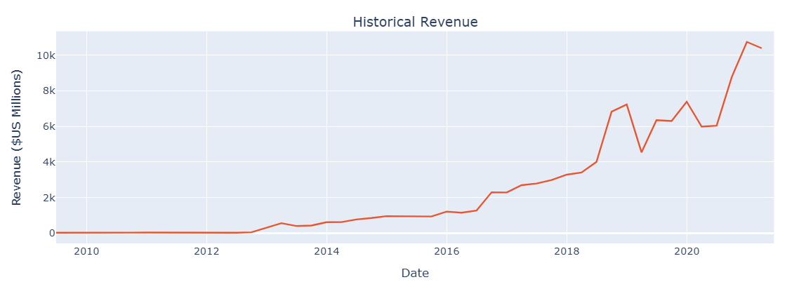
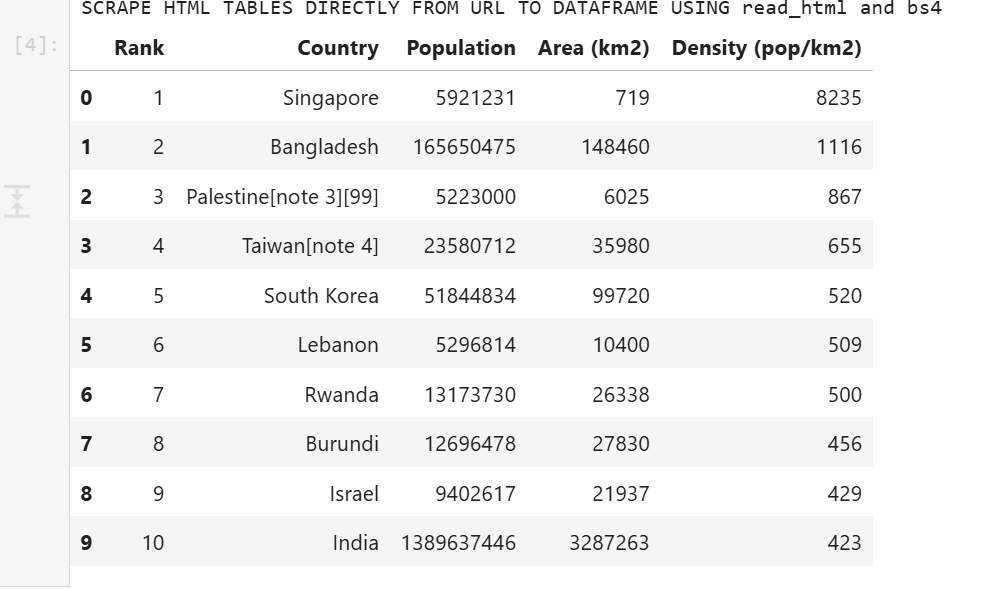

# Web_scraping

The repository contains:
1. WebScraping - TeslaVSGmeDashboard.py - Tesla VS GME import of historical stock data using yfinance. Import of revenue data from table scraped from a webpage using read_html(match table title). Visual representation of both for both Tesla and GME.
2. NETFLIX - WebScraping.py - Netflix import of historical stock data using yfinance. Import of data from table scraped from a webpage using find_all and a loop and using read_html.
3. Webscraping basics.py Web_scraping basics - downloading html through Requests and parsing through BeautifulSoup, searching for tag objects, searching for tables, use of read_html and bs4.

Dataset Sources: 
1.  Macrotrends stocks data https://cf-courses-data.s3.us.cloud-object-storage.appdomain.cloud/IBMDeveloperSkillsNetwork-PY0220EN-SkillsNetwork/labs/project/revenue.htm (originally from: https://www.macrotrends.net/stocks/charts/tsla/tesla/revenue)
2.  Yahoo finance stocks data https://cf-courses-data.s3.us.cloud-object-storage.appdomain.cloud/IBMDeveloperSkillsNetwork-PY0220EN-SkillsNetwork/labs/project/netflix_data_webpage.html (originally from: Netflix, Inc. (NFLX) Stock Price, News, Quote & History - Yahoo Finance)
3.  HTML data available from IBM course "Python Project for Data Science" (https://www.coursera.org/learn/python-project-for-data-science/home/module/1)

Technologies Used: Python, Pandas, BeautifuLSoup, Requests, yfinance, IPython
Installation: copy and run the code in Jupyter Notebooks or other Python editor of choice.

Example of results:

